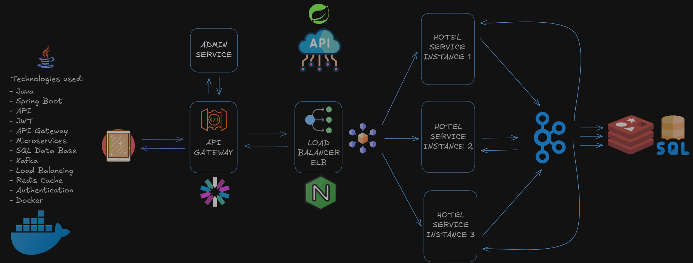

# Hotel Services API

## Project Diagram



## Overview
The Hotel Services API is a microservices-based application designed to provide comprehensive hotel management services. The system is built using Java and Spring Boot, leveraging a range of modern technologies to ensure scalability, reliability, and performance. The architecture includes multiple microservices that handle different aspects of hotel management, such as hotel information, reservations, and customer interactions.

### Key Features:
- **Microservices Architecture**: The application is divided into several microservices, each responsible for a specific domain within the hotel management system. This modular approach allows for independent development, deployment, and scaling of each service.
- **Redis Cache**: Redis is used as a NoSQL database for caching frequently accessed data, reducing the load on the primary database and improving response times.
- **Nginx as ELB**: Nginx is configured as an Elastic Load Balancer (ELB) to distribute incoming client requests across multiple instances of the Hotel Service, ensuring high availability and fault tolerance.
- **API Gateway**: An API Gateway is employed to route client requests to the appropriate microservice instances, providing a single entry point for all client interactions and enabling centralized management of authentication, logging, and rate limiting.
- **Reactive Programming**: The application uses Reactor for reactive programming, allowing for efficient handling of asynchronous operations and improving the overall responsiveness of the system.
- **Kafka**: Kafka is integrated for message brokering, facilitating reliable communication between microservices and enabling event-driven architecture.

## Technologies Used
- **Java 17**: The primary programming language used to build the application.
- **Spring Boot 3.0**: The framework used for building the API with features like dependency injection, data access, and more.
- **Redis**: The NoSQL database used for caching.
- **Nginx**: Used as an Elastic Load Balancer (ELB).
- **Docker**: Containerization tool used for packaging and running the application in isolated environments.
- **Kafka**: Used for message brokering.
- **Reactor**: For reactive programming.
- **Maven**: Build automation tool used for project dependency management.

## Prerequisites
- Java 17 or higher
- Maven 3.6.3 or higher
- Docker
- Docker Compose

## Installation

### Clone the Repository
```sh
git clone https://github.com/yourusername/hotel-services-api.git
cd hotel-services-api
```

# Build the Project

```sh
mvn clean install
```

# Running the Services with Docker Compose
Ensure Docker and Docker Compose are installed and running on your machine.

```sh
docker-compose up --build
```

This command will start the following services:  
- Kafka UI
- Nginx
- Hotel Service Instances (3 instances)
- Redis Cache

# Configuration
The application configuration is located in `src/main/resources/application.yaml`.  

# API Endpoints
The API Gateway routes requests to the appropriate Hotel Service instances. Below are some of the key endpoints:

- POST /hotels - Create a new hotel
- GET /hotels - Retrieve all hotels

# Example Request

Create a Hotel

```sh
POST http://localhost:8080/hotels -H "Content-Type: application/json" -d '{
    "name": "Hotel ABC",
    "location": "New York",
    "rating": 4.5
}'
```

# Example Response

```json
{
    "id": 1,
    "name": "Hotel ABC",
    "location": "New York",
    "rating": 4.5
}
```

# Project Structure
The project is organized following best practices for clean architecture and modular design.

```
├── src
│   ├── main
│   │   ├── java/com/example
│   │   │   ├── application       # Main application entry point
│   │   │   ├── controller        # REST controllers
│   │   │   ├── domain            # Domain models
│   │   │   ├── request           # Request models
│   │   │   ├── infrastructure    # Infrastructure components
│   │   │   ├── entity            # Entity models
│   │   │   ├── repository        # Repository interfaces
│   │   │   ├── service           # Service implementations
│   │   │   └── util              # Utility classes
│   │   └── resources
│   │       ├── application.yaml  # Configuration File
├── docker
│   ├── Dockerfile                # Dockerfile for building the application image
│   ├── docker-compose.yml        # Docker Compose file for running the services
├── nginx
│   ├── nginx.conf                # Nginx configuration file
├── README.md                      # Documentation
└── pom.xml                        # Maven configuration
```

# Running the Application
# Build the Project
After configuring the database, you need to build the project. Run the following Maven command in the project root directory to install dependencies:

```sh
mvn spring-boot:run
```

# Run the Application
To start the application, execute the following command:

```sh
mvn spring-boot:run
```

By default, the application runs on ` http://localhost:8080/api.`

# Docker Prerequisites
To run this project, you must have Docker installed on your machine. Docker enables you to create a containerized instance of the application, which behaves as if it is running locally. This setup simplifies the process of managing dependencies and configurations, ensuring consistency across different environments.  

Running the Application with Docker

To run the application using Docker:  
Build and Start the Containers

Run the following command in the project directory to build the Docker images and start the containers:

```sh
docker-compose up --build
```

Once the services are up, access the Swagger UI at:  http://localhost:8080/swagger-ui/index.html  
Stopping the Containers
When you’re done testing, stop the services using:

```sh
docker-compose down
```

# API Documentation
The project includes OpenAPI (Swagger) for API documentation. After the application is up and running, you can view and interact with the API documentation at:  http://localhost:8080/api/swagger-ui/index.html  

# Unit Testing
To run the tests for the application, use the following command:

```sh
mvn test
```

