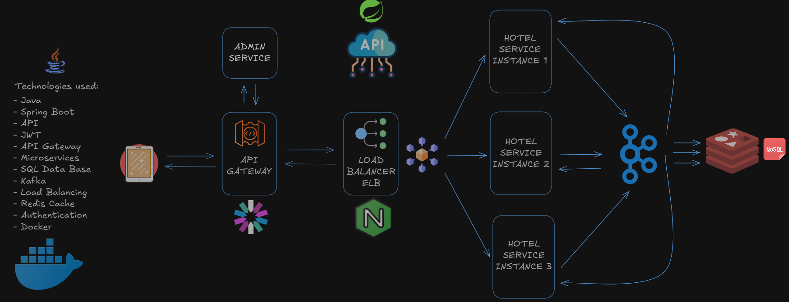

# Hotel Services API

## Project Diagram



## Overview
The Hotel Services API is a microservices-based application designed to provide comprehensive hotel management services. The system is built using Java and Spring Boot, leveraging a range of modern technologies to ensure scalability, reliability, and performance. The architecture includes multiple microservices that handle different aspects of hotel management, such as hotel information, reservations, and customer interactions.

### Key Features:
- **Microservices Architecture**: The application is divided into several microservices, each responsible for a specific domain within the hotel management system. This modular approach allows for independent development, deployment, and scaling of each service.
- **Redis Cache**: Redis is used as a NoSQL database for caching frequently accessed data, reducing the load on the primary database and improving response times.
- **Nginx as ELB**: Nginx is configured as an Elastic Load Balancer (ELB) to distribute incoming client requests across multiple instances of the Hotel Service, ensuring high availability and fault tolerance.
- **API Gateway**: An API Gateway is employed to route client requests to the appropriate microservice instances, providing a single entry point for all client interactions and enabling centralized management of authentication, logging, and rate limiting.
- **Reactive Programming**: The application uses Reactor for reactive programming, allowing for efficient handling of asynchronous operations and improving the overall responsiveness of the system.
- **Kafka**: Kafka is integrated for message brokering, facilitating reliable communication between microservices and enabling event-driven architecture.

## Technologies Used
- **Java 17**: The primary programming language used to build the application.
- **Spring Boot 3.0**: The framework used for building the API with features like dependency injection, data access, and more.
- **Redis**: The NoSQL database used for caching.
- **Nginx**: Used as an Elastic Load Balancer (ELB).
- **Docker**: Containerization tool used for packaging and running the application in isolated environments.
- **Kafka**: Used for message brokering.
- **Reactor**: For reactive programming.
- **Maven**: Build automation tool used for project dependency management.

## Prerequisites
- Java 17 or higher
- Maven 3.6.3 or higher
- Docker
- Docker Compose

## Installation

### Clone the Repository
```sh
git clone https://github.com/yourusername/hotel-services-api.git
cd hotel-services-api
```

# Build the Project

```sh
mvn clean install
```

# Running the Services with Docker Compose
Ensure Docker and Docker Compose are installed and running on your machine.

```sh
docker-compose up --build
```

This command will start the following services:  
- Kafka UI
- Nginx
- Hotel Service Instances (3 instances)
- Redis Cache

# Configuration
The application configuration is located in `src/main/resources/application.yaml`.  

# API Endpoints
The API Gateway routes requests to the appropriate Hotel Service instances. Below are some of the key endpoints:

- POST /hotels - Create a new hotel
- GET /hotels - Retrieve all hotels

# Example Request

Create a Hotel